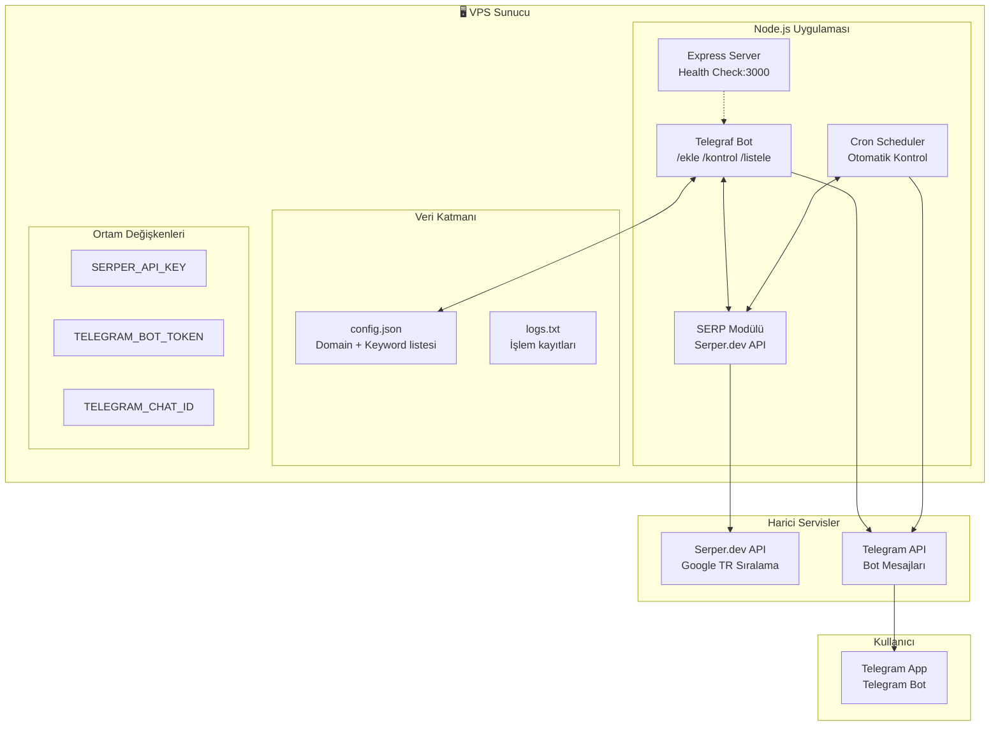
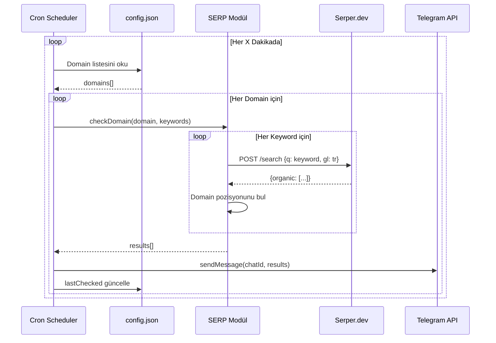
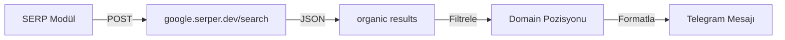
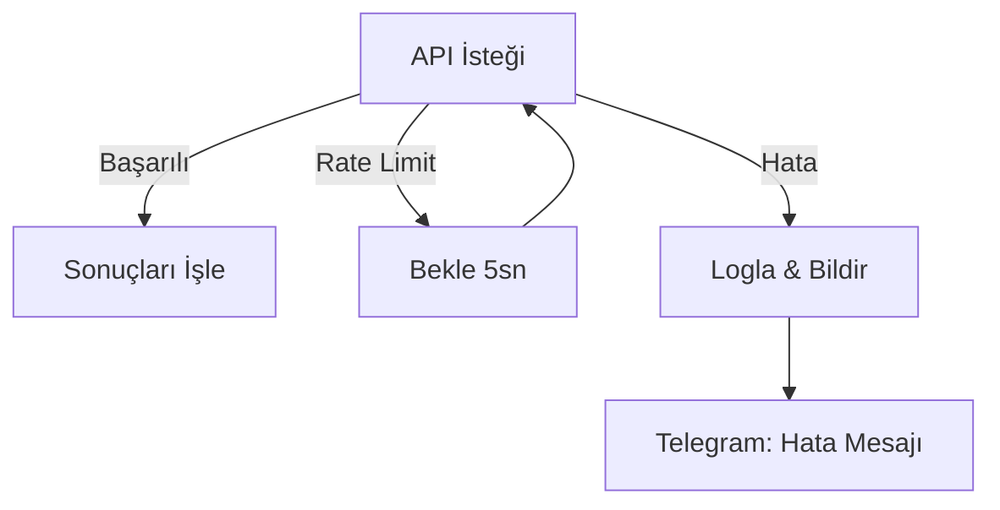

# SERP Tracker - VPS Mimari Planı

## 1. Sistem Genel Bakış



## 2. Bileşenler

### 2.1 Telegram Bot Komutları

| Komut | Parametre | Açıklama | Örnek |
|-------|-----------|----------|-------|
| `/ekle` | `domain kw1,kw2` | Domain ve keyword ekle | `/ekle example.com seo,tasarım` |
| `/kontrol` | `domain` | Anlık sıralama kontrolü | `/kontrol example.com` |
| `/listele` | - | Tüm domainleri listele | `/listele` |
| `/sil` | `domain` | Domain sil | `/sil example.com` |
| `/aralik` | `dakika` | Otomatik kontrol aralığı | `/aralik 60` |
| `/otomatik` | `ac/kapat` | Otomatik kontrol aç/kapat | `/otomatik ac` |
| `/durum` | - | Bot durumunu göster | `/durum` |

### 2.2 Veri Yapısı (config.json)

```json
{
  "domains": [
    {
      "domain": "example.com",
      "keywords": ["seo", "web tasarım", "digital pazarlama"],
      "addedAt": "2025-01-20T10:00:00Z",
      "lastChecked": "2025-01-20T15:30:00Z",
      "checkCount": 5
    }
  ],
  "settings": {
    "autoCheck": true,
    "intervalMinutes": 60,
    "notifyOnChangeOnly": false
  }
}
```

### 2.3 Otomatik Kontrol Akışı



## 3. VPS Yapılandırması

### 3.1 PM2 Konfigürasyonu (ecosystem.config.js)

```javascript
module.exports = {
  apps: [{
    name: 'serp-tracker',
    script: './server.js',
    instances: 1,
    exec_mode: 'fork',
    watch: false,
    max_memory_restart: '500M',
    env: {
      NODE_ENV: 'production'
    },
    log_date_format: 'YYYY-MM-DD HH:mm:ss Z',
    error_file: './logs/err.log',
    out_file: './logs/out.log',
    log_file: './logs/combined.log',
    time: true
  }]
}
```

### 3.2 Deployment Adımları

```bash
# 1. VPS'de gerekli paketler
sudo apt update
sudo apt install -y nodejs npm git

# 2. PM2 kurulumu
sudo npm install -g pm2

# 3. Proje kurulumu
cd /opt
git clone [repo-url] serp-tracker
cd serp-tracker
npm install

# 4. Çevre değişkenleri
cp .env.example .env
nano .env  # API anahtarlarını gir

# 5. PM2 ile başlat
pm2 start ecosystem.config.js
pm2 save
pm2 startup

# 6. Log kontrolü
pm2 logs serp-tracker
```

## 4. Serper.dev API Entegrasyonu



### API İsteği
```json
{
  "q": "seo",
  "gl": "tr",
  "hl": "tr",
  "num": 100
}
```

### Yanıt İşleme
```javascript
// İlk 100 sonuçta domain ara
for (const item of organicResults) {
  if (item.link.includes(cleanDomain)) {
    return {
      keyword: keyword,
      position: item.position,
      url: item.link
    }
  }
}
```

## 5. Hata Yönetimi & Retry Mekanizması



## 6. Güvenlik

- `.env` dosyası `.gitignore`'da
- API anahtarları environment variable
- `config.json` backup stratejisi
- PM2 log rotasyonu

## 7. Ölçeklenebilirlik

| Domain Sayısı | Keyword/Domain | Kontrol Süresi | Tavsiye Aralık |
|---------------|----------------|----------------|----------------|
| 1-5           | 1-10           | ~2-5 dk        | 30-60 dk       |
| 5-10          | 1-10           | ~10-15 dk      | 60-120 dk      |
| 10+           | 10+            | ~30+ dk        | 180+ dk        |

---

## Özet

Bu mimari:
1. ✅ VPS'de PM2 ile sürekli çalışır
2. ✅ Telegram komutlarıyla yönetilir
3. ✅ Sınırsız domain + keyword destekler
4. ✅ Özelleştirilebilir otomatik kontrol aralığı
5. ✅ Serper.dev API ile Türkiye Google sıralaması verir
